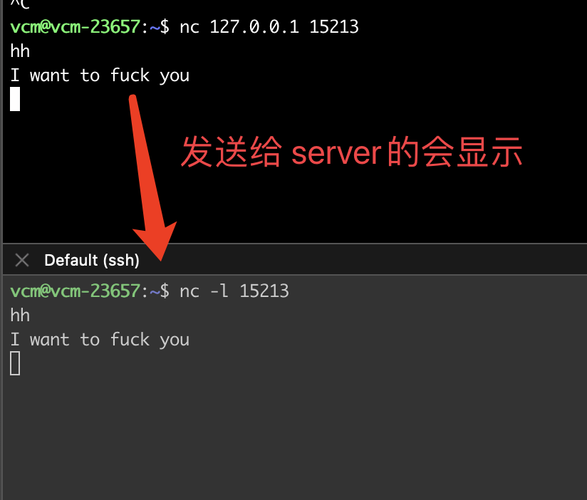

# 1 Proxy 介绍

**Proxyies are useful for many purposes**

* proxies are used in firewalls, so that browsers behind a firewall can only contact a server beyond the firewall via the proxy
* Proxies can also act as anonymizers by stripping requests of all identifyin infromation
    * a proxy can make the browser anonymous to Web Servers
* Proxies can also be used to cache web objects by storing local copies of objects from servers then responding to future requests by reaidng them out of its cache rather than by communcaing again with remote servers

# 2 Debuging 的tech 介绍

> **telnet**

* telent can be used to open a connection to your proxy and sent it HTTP requests

> **curl**

* we can use curl to generate HTTP requests to any server, including your own proxy

> **netcat**

 通常的用法是

* simple TCP proxies
* shell-script based HTTP clients and servers
* network daemon testing
* a SOCKS or HTTP ProxyCommand for ssh

一些通常的用法

**Case1: Client / Server Model**

* there will be a connection between ports
* 在连接建立之后, `nc` does not really care which side is being used as a server and which side is being used as a client
* the connection can be terminated using an EOF 

